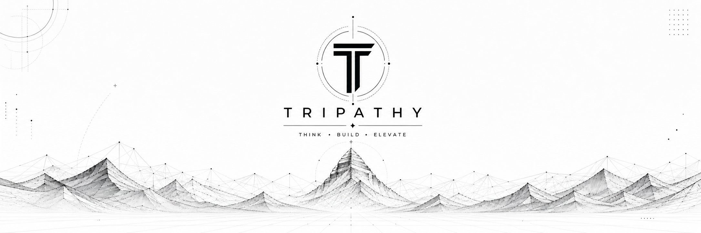

<p align="center">
  
</p>

<div align="center">

`a digital monk in the AI-native present`

[Palo Alto](https://tripathy.ai) · [Paloa Labs](https://paloa.ai) · [Zigsaw](https://zigsaw.dev) · [tripathy.ai](https://tripathy.ai)

</div>

> a decade of code; now agents read the diff, write the patch,
> and argue with each other before humans see it.
>
> currently the most recent external contributor to NVIDIA's Alpamayo —
> 31 consecutive PRs, sustained over four days.

<p align="center">
  <a href="https://skillicons.dev"></a>
</p>

<div align="center"><sub>·  ·  ·</sub></div>

## ◉  shipped

<table>
<tr>
<td align="center" width="33%">
<br/>
<sub><b>shipped upstream</b></sub>
</td>
<td align="center" width="33%">
<br/>
<sub><b>awaiting merge</b></sub>
</td>
<td align="center" width="33%">
<br/>
<sub><b>in active review</b></sub>
</td>
</tr>
</table>

| # | PR | Repo | What |
|---|---|---|---|
| 1 | [`alpamayo#73`](https://github.com/NVlabs/alpamayo/pull/73) | NVlabs/alpamayo | Replace `assert` with `ValueError` so input validation survives `python -O` |
| 2 | [`openclaw#77446`](https://github.com/openclaw/openclaw/pull/77446) | openclaw/openclaw | Pin container-side workspace and config dirs in `docker compose` |
| 3 | [`openclaw#74638`](https://github.com/openclaw/openclaw/pull/74638) | openclaw/openclaw | Accept `browser.tabCleanup` keys in zod schema |
| 4 | [`warp#9558`](https://github.com/warpdotdev/warp/pull/9558) | warpdotdev/warp | Align OSS `.desktop` `Exec` with packaged binary name |
| 5 | [`warp#9563`](https://github.com/warpdotdev/warp/pull/9563) | warpdotdev/warp | Attribute Alacritty/vte derivative code in two more files |
| 6 | [`warp#9667`](https://github.com/warpdotdev/warp/pull/9667) | warpdotdev/warp | Recognize Mistral Vibe as a CLI agent |
| 7 | [`warp#9670`](https://github.com/warpdotdev/warp/pull/9670) | warpdotdev/warp | Route `CLIAgent::Pi` to the default session listener |
| 8 | [`Megatron-Bridge#3649`](https://github.com/NVIDIA-NeMo/Megatron-Bridge/pull/3649) | NVIDIA-NeMo/Megatron-Bridge | Add NVIDIA copyright headers to four package `__init__.py` files |
| 9 | [`Megatron-Bridge#3647`](https://github.com/NVIDIA-NeMo/Megatron-Bridge/pull/3647) | NVIDIA-NeMo/Megatron-Bridge | Forward MoE / MTP metrics to MLFlow and Comet |
| 10 | [`Megatron-Bridge#3646`](https://github.com/NVIDIA-NeMo/Megatron-Bridge/pull/3646) | NVIDIA-NeMo/Megatron-Bridge | Unit tests for `qwen2_audio` and `kimi_k25_vl` recipes |
| 11 | [`openclaw#77372`](https://github.com/openclaw/openclaw/pull/77372) | openclaw/openclaw | Forward workspace bootstrap into `developerInstructions` (codex/app-server) |
| 12 | [`warp#9712`](https://github.com/warpdotdev/warp/pull/9712) | warpdotdev/warp | Register Rename Active Pane as a keyboard-bindable action |
| 13 | [`warp#10019`](https://github.com/warpdotdev/warp/pull/10019) | warpdotdev/warp | Avoid duplicate apt source entries when `.sources` exists |
| 14 | [`Megatron-Bridge#3645`](https://github.com/NVIDIA-NeMo/Megatron-Bridge/pull/3645) | NVIDIA-NeMo/Megatron-Bridge | Aggregate TensorBoard memory metrics across PP group |
| 15 | [`Megatron-Bridge#3650`](https://github.com/NVIDIA-NeMo/Megatron-Bridge/pull/3650) | NVIDIA-NeMo/Megatron-Bridge | Unit tests for `pg_utils` helpers |
| 16 | [`Megatron-Bridge#3652`](https://github.com/NVIDIA-NeMo/Megatron-Bridge/pull/3652) | NVIDIA-NeMo/Megatron-Bridge | Unit tests for `CometPlugin` |
| 17 | [`Megatron-Bridge#3695`](https://github.com/NVIDIA-NeMo/Megatron-Bridge/pull/3695) | NVIDIA-NeMo/Megatron-Bridge | MLA, MTP, and provider-override coverage for FLOPs / MFU |
| 18 | [`warp#9671`](https://github.com/warpdotdev/warp/pull/9671) | warpdotdev/warp | Clear permission-scoped state when leaving the permission flow |

<div align="center"><sub>·  ·  ·</sub></div>

## ◉  the year so far

<p align="center">
  
</p>

<p align="center">
  
</p>

```text
$ git log --since=2026-01-01 --shortstat | langstats

Python      ████████████████████████████   73.6%
TypeScript  ██████                         16.6%
HTML        ██                              5.1%
Other       █                               3.5%
Rust                                        1.2%
─────────────────────────────────────────────────
1,023 commits  ·  5 languages  ·  30 active repos
```

## ◉  building

### Developer Tools & Platforms

- 🌐 **[site2cli](https://github.com/lonexreb/site2cli)**  — Any website → CLI/API for AI agents. v0.6.0 on PyPI, MCP-native, 500+ tests.
- 🔬 **[MCPstudio](https://github.com/lonexreb/MCPstudio)** — The Postman for MCP. Visual create/test/manage MCP servers, FastAPI + React + DDD.
- 🧩 **[zigsaw](https://github.com/lonexreb/zigsaw)** — AI workflow automation: chat or drag-and-drop, multi-LLM, instant API deploy, 100+ integrations.
- 🔭 **[kalam](https://github.com/lonexreb/kalam)** — Terminal agent for science / chip design / hardware / sec — arXiv, Yosys, ngspice, nmap, Ghidra MCPs. Named for Dr. APJ Abdul Kalam.
- 🔄 **[mobius](https://github.com/lonexreb/mobius)** — High-performance autonomous ML experimentation framework. Rust + Go + Python.
- 🌟 **[morningstar](https://github.com/lonexreb/morningstar)** — Notion PRD → working code with tests + Slack updates. Powered by Claude Code.
- 🧱 **[deepagents](https://github.com/lonexreb/deepagents)** — Batteries-included LangChain + LangGraph harness. `pip install deepagents`.
- 🐟 **[aish](https://github.com/lonexreb/aish)** — Anthropic-marketplace Claude Code plugin — GPU control plane via TensorDock + Modal MCP.
- 📊 **[compgit](https://github.com/lonexreb/compgit)** — GitHub commits, quietly visible. Chrome / iPhone / macOS.

### AI Agent Systems & RL

- 🐙 **[tentalis](https://github.com/lonexreb/tentalis)** — ADHR meta-RL: agents that learn from manager feedback. GRPO / CISPO / DAPO + NATS + HaluGate.
- ⚡ **[RLYX-enhancer](https://github.com/lonexreb/RLYX-enhancer)** — Hackable GRPO with high-speed weight sync for multi-node RL.
- 🤖 **[AGI-INC](https://github.com/lonexreb/AGI-INC)** — HALO-Agent for AGI Inc REAL Benchmark (112 web tasks, 11 sites). Gemini 3.1 Pro, 38.5% on zero-site.
- 🎓 **[university-sim](https://github.com/lonexreb/university-sim)** — Multi-agent university benchmark: Concordia GM + OpenClaw + emergence metrics.
- 🌸 **[flwr-frl-kit](https://github.com/lonexreb/flwr-frl-kit)** — Federated RL Kit for [flower.ai](https://flower.ai).
- 📈 **[DeepFinRL-UMass](https://github.com/lonexreb/DeepFinRL-UMass)** — Hierarchical MARL trader with Director + analyst agents, LLM sentiment, PPO/CPPO/GRPO.
- 🔬 **[autoresearch](https://github.com/lonexreb/autoresearch)** — Single-GPU research agents for Karpathy's nanochat — Lévy flights, Metropolis-Hastings, hippocampal replay, golden-angle sampling.
- 🧮 **[claude-code-math-skills](https://github.com/lonexreb/claude-code-math-skills)** — 7-agent Generator–Critic loop for rigorous math; Lean 4 + SymPy verifiers, Putnam/IMO benchmarks.

### F1 & Motorsport AI

- 🏎️ **[aero-agent](https://github.com/lonexreb/aero-agent)** — CFD-aware research assistant for F1 aerodynamicists; optimize every sim hour under FIA ATR caps.
- 🔍 **[sim-scout](https://github.com/lonexreb/sim-scout)** — Paper → benchmarked OpenFOAM sim in hours, not weeks.
- 🏁 **[f1-design-ai](https://github.com/lonexreb/f1-design-ai)** — Blender geometry + OpenFOAM CFD + ParaView, orchestrated by OpenClaw.

### Founder Performance & Health

- 🧬 **[FounderAgent](https://github.com/lonexreb/FounderAgent)** — Health-aware agent: reads biometrics → blocks calendar, sets DND, sends recovery protocols.
- 🏆 **[FounderLeague](https://github.com/lonexreb/FounderLeague)** — Anti-hustle-culture leaderboards: founders compete on readiness, sleep, recovery.
- 🧠 **[GameDay-AMS](https://github.com/lonexreb/GameDay-AMS)** — Cognitive Performance System for Founders — sports science meets knowledge work.
- 🔋 **[FocusFuel-API](https://github.com/lonexreb/FocusFuel-API)** — Wearable data → cognitive performance predictions. 35 tests passing.
- 🩺 **[AgentKit-Health](https://github.com/lonexreb/AgentKit-Health)** — Marketplace of pre-built health agents — Sleep Coach, Burnout Detector, Recovery Agent.
- 💪 **[grithub](https://github.com/lonexreb/grithub)** — Sports + healthcare with BioGears physiological sim. Hacklytics 2025 winner.

### Applied AI & Data

- 🏀 **[paloa-claw](https://github.com/lonexreb/paloa-claw)** — Personal basketball AI training assistant.
- 🏥 **[clinical-trials-api](https://github.com/lonexreb/clinical-trials-api)** — ETL + REST API for ClinicalTrials.gov; PostgreSQL, live on Render.
- 📧 **[sdr-automation](https://github.com/lonexreb/sdr-automation)** — SDR research + outreach pipeline. YC AI Hackathon, built on Zigsaw.
- 📺 **[zigsaw-labs](https://github.com/lonexreb/zigsaw-labs)** — Auto-generates, tests, optimizes short-form ads across TikTok, Reels, Shorts.
- 📝 **[grammer-paraphrase-system](https://github.com/lonexreb/grammer-paraphrase-system)** — Grammar correction + paraphrasing, clean DDD architecture.
- 🏠 **[HandyHommieAI](https://github.com/lonexreb/HandyHommieAI)** — Home appliance command center: upload manuals, ask questions, auto-call manufacturer support.
- 🎯 **[growthclaw](https://github.com/lonexreb/growthclaw)** — Founder-scouting outbound for Crowdstake AI. Product Hunt / Reddit / IH at ~$0.02/lead. Austin Hackathon.
- 🔲 **[kalam-placer](https://github.com/lonexreb/kalam-placer)** — Chip macro placement optimizer — Partcl + HRT $20K competition. ibm01 benchmark.

### Fun & EdTech

- ♟️ **[dolphine-chess](https://github.com/lonexreb/dolphine-chess)** — Multi-tenant SaaS chess academy platform.
- 🍁 **[Maple](https://github.com/lonexreb/Maple)** — Emotion-aware AI tutor — Hume EVI + DBRX/LanceDB RAG + Midnight blockchain integrity.
- 🃏 **[blackjack-for-toddler](https://github.com/lonexreb/blackjack-for-toddler)** — Toddler Blackjack teaching numbers + addition. React PWA + Capacitor for iOS.
- 🃏 **[poker-for-toddler](https://github.com/lonexreb/poker-for-toddler)** — Texas Hold'em for kids (4–9) with toy cars, gems, crowns. React PWA on Vercel.
- 🕉️ **[Mahamrutyunjay-Mantra-Counter](https://github.com/lonexreb/Mahamrutyunjay-Mantra-Counter)** — macOS app for tracking mantra chanting via voice detection. 1–108 visual progress.
- 🇮🇳 **[xplncert](https://github.com/lonexreb/xplncert)** — Inventors walk you through NCERT — AI persona videos for Indian class 6–12 textbooks.

<div align="center"><sub>·  ·  ·</sub></div>

## ◉  upstream

when the model is stuck, you can either complain or send a patch. i've been sending patches — across NVIDIA's open AV / RL / training stack, the agentic tooling layer, and the terminal layer.

### 🌟 Featured: <a href="https://github.com/NVlabs/alpamayo">NVlabs/alpamayo</a> — NVIDIA's open foundational driving model (Physical AI / AV) <em>(32 PRs)</em>

**The last 32 consecutive PRs to the repo are mine** (1 merged, 31 in review) — a sustained sprint hardening NVIDIA's open foundational driving model across input validation, runtime/attention correctness, type annotations, evaluation metrics, regression tests, docstring-vs-code drift, and first-run onboarding.

#### Validation & input handling

| PR | Status | What it does |
|---|---|---|
| [`#73`](https://github.com/NVlabs/alpamayo/pull/73) | ✅ merged | Replace `assert` with `ValueError` in `load_physical_aiavdataset()` so input validation survives `python -O` |
| [`#74`](https://github.com/NVlabs/alpamayo/pull/74) | open | Actionable HuggingFace dataset-access errors — surface gated-repo / 401 / 403 instead of confusing `IndexError` (fixes #59, #61) |
| [`#77`](https://github.com/NVlabs/alpamayo/pull/77) | open | Replace `assert` with `ValueError` across public-API input validation |
| [`#84`](https://github.com/NVlabs/alpamayo/pull/84) | open | Replace mutable default list with `None` sentinel in `basic_collation_fn` |
| [`#94`](https://github.com/NVlabs/alpamayo/pull/94) | open | Replace `assert`s with `ValueError` in `chat_template/conversation.py` |

#### Runtime & compatibility

| PR | Status | What it does |
|---|---|---|
| [`#75`](https://github.com/NVlabs/alpamayo/pull/75) | open | Pin expert decoder to SDPA so the model loads when Flash-Attention 2 is globally enabled (fixes #52) |
| [`#78`](https://github.com/NVlabs/alpamayo/pull/78) | open | Remove deprecated `local_dir_use_symlinks` arg from `snapshot_download()` call |
| [`#80`](https://github.com/NVlabs/alpamayo/pull/80) | open | Preserve integer/bool tensor dtype in `to_device()` (fixes #36) |
| [`#99`](https://github.com/NVlabs/alpamayo/pull/99) | open | Use `dim=` instead of `axis=` in `comfort_reward._within_bound` (PyTorch idiom) |

#### Type annotations & API contracts

| PR | Status | What it does |
|---|---|---|
| [`#85`](https://github.com/NVlabs/alpamayo/pull/85) | open | Fix `get_label_mask` docstrings and `get_assistant_mask` return type |
| [`#89`](https://github.com/NVlabs/alpamayo/pull/89) | open | Document exclusive-end `chunk_ids` range and broaden type annotation in `pai_utils` |
| [`#92`](https://github.com/NVlabs/alpamayo/pull/92) | open | Fix `MetricRunner.run()` return-type annotation and document its side effect |
| [`#95`](https://github.com/NVlabs/alpamayo/pull/95) | open | Fix `viz.py` type hints — optional waypoints + `rotate_90cc` annotations |
| [`#96`](https://github.com/NVlabs/alpamayo/pull/96) | open | Type-fix `init_wandb` `key` parameter and `_save_wandb_id` return type |

#### New evaluation metrics

| PR | Status | What it does |
|---|---|---|
| [`#101`](https://github.com/NVlabs/alpamayo/pull/101) | open | Add Final Displacement Error (FDE) and minFDE metrics to evaluation suite |
| [`#102`](https://github.com/NVlabs/alpamayo/pull/102) | open | Add trajectory smoothness metrics for evaluation |

#### Docs & docstring sync

| PR | Status | What it does |
|---|---|---|
| [`#76`](https://github.com/NVlabs/alpamayo/pull/76) | open | Clarify coordinate-frame conventions for `project_waypoints_ftheta` (refs #34) |
| [`#79`](https://github.com/NVlabs/alpamayo/pull/79) | open | Expand Troubleshooting with HF auth, FA2 `cu_seqlens`, and smoke tests for first-time users |
| [`#82`](https://github.com/NVlabs/alpamayo/pull/82) | open | Sync README project-structure tree with on-disk layout |
| [`#83`](https://github.com/NVlabs/alpamayo/pull/83) | open | Sync `load_physical_aiavdataset` docstring with the code |
| [`#86`](https://github.com/NVlabs/alpamayo/pull/86) | open | Sync metric docstrings with the keys actually returned |
| [`#87`](https://github.com/NVlabs/alpamayo/pull/87) | open | Document exclusive-end `--chunk` range in `curate_pai_samples.py` |
| [`#93`](https://github.com/NVlabs/alpamayo/pull/93) | open | Sync `DistanceMetrics` docstrings with the actual signature and returns |
| [`#98`](https://github.com/NVlabs/alpamayo/pull/98) | open | Fix `launch_alpamayo_model` docstring — checkpoint source is `--config` arg, not env var |
| [`#104`](https://github.com/NVlabs/alpamayo/pull/104) | open | Point install-issue triage in README to `alpamayo_r1.healthcheck` first |

#### Tests & DX

| PR | Status | What it does |
|---|---|---|
| [`#81`](https://github.com/NVlabs/alpamayo/pull/81) | open | Accept multiple `--chunk-ids` without quoting in `download_pai.py` |
| [`#88`](https://github.com/NVlabs/alpamayo/pull/88) | open | Remove commented-out debug print in `QwenProcessor._preprocess_data` |
| [`#90`](https://github.com/NVlabs/alpamayo/pull/90) | open | Add regression tests for `basic_collation_fn` and `get_assistant_mask` |
| [`#91`](https://github.com/NVlabs/alpamayo/pull/91) | open | Add regression tests for `compute_minade` and `summarize_metric` keys |
| [`#97`](https://github.com/NVlabs/alpamayo/pull/97) | open | Remove dead misplaced shebang from `convert_release_config_to_training.py` |
| [`#100`](https://github.com/NVlabs/alpamayo/pull/100) | open | Add CLI flags to `test_inference.py` without changing default behavior |
| [`#103`](https://github.com/NVlabs/alpamayo/pull/103) | open | Add `python -m alpamayo_r1.healthcheck` install smoke test |

### <a href="https://github.com/NVIDIA-NeMo/RL">NVIDIA-NeMo/RL</a> — NVIDIA's RL framework for LLM post-training (GRPO, DAPO, Megatron) <em>(9 PRs)</em>

Production-grade error handling, configuration ergonomics, and test coverage for the GRPO / Megatron training loop.

| PR | Status | What it does |
|---|---|---|
| [`#2395`](https://github.com/NVIDIA-NeMo/RL/pull/2395) | open | Clearer error when GRPO `overlong_filtering` finds no `truncated` field |
| [`#2394`](https://github.com/NVIDIA-NeMo/RL/pull/2394) | open | Hard-fail when `nemo_gym` rollout collection returns fewer rows than requested |
| [`#2393`](https://github.com/NVIDIA-NeMo/RL/pull/2393) | open | Extend worker offload guard to v2 + Megatron paths |
| [`#2392`](https://github.com/NVIDIA-NeMo/RL/pull/2392) | open | Clear error when DTensor `train` / `get_logprobs` / `score` is called while offloaded |
| [`#2391`](https://github.com/NVIDIA-NeMo/RL/pull/2391) | open | Expose Megatron checkpoint parallelism and RNG knobs to user config |
| [`#2390`](https://github.com/NVIDIA-NeMo/RL/pull/2390) | open | Expose hardcoded Megatron infrastructure params to user config |
| [`#2389`](https://github.com/NVIDIA-NeMo/RL/pull/2389) | open | Add author field to README citation BibTeX |
| [`#2388`](https://github.com/NVIDIA-NeMo/RL/pull/2388) | open | Bump `accelerate` floor to 1.1.0 for `transformers` 5.3.0 compat |
| [`#2387`](https://github.com/NVIDIA-NeMo/RL/pull/2387) | open | Test coverage for converter CLI entry points |

### <a href="https://github.com/NVIDIA-NeMo/Megatron-Bridge">NVIDIA-NeMo/Megatron-Bridge</a> — NVIDIA's bridge between Megatron-LM and NeMo training recipes <em>(11 PRs · 7 merged)</em>

**7 PRs merged** — test coverage and observability across VLM / audio recipes, plus data-pipeline, TB-memory-aggregation, FLOPs/MFU instrumentation, and model-bridge work.

| PR | Status | What it does |
|---|---|---|
| [`#3695`](https://github.com/NVIDIA-NeMo/Megatron-Bridge/pull/3695) | ✅ merged | MLA, MTP, and provider-override coverage for FLOPs / MFU |
| [`#3652`](https://github.com/NVIDIA-NeMo/Megatron-Bridge/pull/3652) | ✅ merged | Unit tests for `CometPlugin` |
| [`#3650`](https://github.com/NVIDIA-NeMo/Megatron-Bridge/pull/3650) | ✅ merged | Unit tests for `pg_utils` helpers |
| [`#3649`](https://github.com/NVIDIA-NeMo/Megatron-Bridge/pull/3649) | ✅ merged | Add NVIDIA copyright headers to four package `__init__.py` files |
| [`#3647`](https://github.com/NVIDIA-NeMo/Megatron-Bridge/pull/3647) | ✅ merged | Forward MoE / MTP metrics to MLFlow and Comet |
| [`#3646`](https://github.com/NVIDIA-NeMo/Megatron-Bridge/pull/3646) | ✅ merged | Unit tests for `qwen2_audio` and `kimi_k25_vl` recipes |
| [`#3645`](https://github.com/NVIDIA-NeMo/Megatron-Bridge/pull/3645) | ✅ merged | Aggregate TensorBoard memory metrics across PP group |
| [`#3698`](https://github.com/NVIDIA-NeMo/Megatron-Bridge/pull/3698) | open | Bridge support for OLMo-2 dense causal LMs |
| [`#3680`](https://github.com/NVIDIA-NeMo/Megatron-Bridge/pull/3680) | open | Unit tests for HuggingFace dataset processors |
| [`#3666`](https://github.com/NVIDIA-NeMo/Megatron-Bridge/pull/3666) | open | Unit tests for `recipes/common.py` base helpers |
| [`#3665`](https://github.com/NVIDIA-NeMo/Megatron-Bridge/pull/3665) | open | Pad chat tensors and `loss_mask` in `pre_pad_dataset` (#2610) |

### <a href="https://github.com/openclaw/openclaw">openclaw/openclaw</a> — agentic coding platform <em>(19 PRs · 3 merged)</em>

📝 **[Workflow notes & lessons learned from this contribution sprint →](https://gist.github.com/lonexreb/fb73a4f67bc011beede2f4dc1be252a4)**

| PR | Status | What it does |
|---|---|---|
| [`#77446`](https://github.com/openclaw/openclaw/pull/77446) | ✅ merged | Pin container-side workspace and config dirs in `docker compose` |
| [`#77372`](https://github.com/openclaw/openclaw/pull/77372) | ✅ merged | Forward workspace bootstrap into `developerInstructions` in codex/app-server |
| [`#74638`](https://github.com/openclaw/openclaw/pull/74638) | ✅ merged | Accept `browser.tabCleanup` keys in zod schema |
| [`#78035`](https://github.com/openclaw/openclaw/pull/78035) | open | Preserve sibling supplement results when one search rejects in `memory-core` |
| [`#77367`](https://github.com/openclaw/openclaw/pull/77367) | open | Scope Discord `command-deploy` cache by application id (multi-tenant isolation, 3 regression tests) |
| [`#75476`](https://github.com/openclaw/openclaw/pull/75476) | open | Honor `model.compat.unsupportedToolSchemaKeywords` for OpenAI-completions tool schemas |
| [`#75445`](https://github.com/openclaw/openclaw/pull/75445) | open | Tolerate unresolved `SecretRef` tokens during Discord/Telegram channel-actions discovery |
| [`#75339`](https://github.com/openclaw/openclaw/pull/75339) | open | Normalize structured `delta.content` blocks to prevent `[object Object]` in chat replies |
| [`#75248`](https://github.com/openclaw/openclaw/pull/75248) | open | Reorder workspace `AGENTS.md` template so load-bearing rules come first |
| [`#75217`](https://github.com/openclaw/openclaw/pull/75217) | open | Honor `skipBootstrap` at the runtime injection path |
| [`#74945`](https://github.com/openclaw/openclaw/pull/74945) | open | Canonicalize `--model` to lowercase before dispatch |
| [`#74891`](https://github.com/openclaw/openclaw/pull/74891) | open | Skip API-key prompt when user skipped installing the skill |
| [`#74643`](https://github.com/openclaw/openclaw/pull/74643) | open | Per-agent `verboseDefault` and `elevatedDefault` config overrides |
| [`#77184`](https://github.com/openclaw/openclaw/pull/77184) | open | Re-export `StatusSummary`, `SessionStatus`, `HeartbeatStatus` from plugin-sdk |
| [`#77189`](https://github.com/openclaw/openclaw/pull/77189) | open | Downgrade expected 1013 "gateway starting" close-before-connect log to debug |
| [`#77191`](https://github.com/openclaw/openclaw/pull/77191) | open | Optional `agentId` filter on `cron.list` with default-agent fallback |
| [`#77197`](https://github.com/openclaw/openclaw/pull/77197) | open | Surface sharp-install hint when image optimizer exhausts every resize attempt |
| [`#77215`](https://github.com/openclaw/openclaw/pull/77215) | open | Document Realtime Talk requires OpenAI Platform credits, not Codex subscription |
| [`#77224`](https://github.com/openclaw/openclaw/pull/77224) | open | Document BlueBubbles channel-vs-plugin disablement layers + safe loopback config |

### <a href="https://github.com/warpdotdev/warp">warpdotdev/warp</a> — agentic terminal <em>(48 PRs · 7 merged · 1 approved)</em>

📝 **[Workflow notes & lessons learned from this contribution sprint →](https://gist.github.com/lonexreb/5e15a6a19988926f0f0fc79808d72971)**

| PR | Status | What it does |
|---|---|---|
| [`#9558`](https://github.com/warpdotdev/warp/pull/9558) | ✅ merged | Align OSS `.desktop` `Exec` with packaged binary name |
| [`#9563`](https://github.com/warpdotdev/warp/pull/9563) | ✅ merged | Attribute Alacritty/vte derivative code in two more files |
| [`#9667`](https://github.com/warpdotdev/warp/pull/9667) | ✅ merged | Recognize Mistral Vibe as a CLI agent |
| [`#9670`](https://github.com/warpdotdev/warp/pull/9670) | ✅ merged | Route `CLIAgent::Pi` to the default session listener |
| [`#9671`](https://github.com/warpdotdev/warp/pull/9671) | ✅ merged | Clear permission-scoped state when leaving the permission flow (#9525) |
| [`#9712`](https://github.com/warpdotdev/warp/pull/9712) | ✅ merged | Register Rename Active Pane as a keyboard-bindable action (#9351) |
| [`#10019`](https://github.com/warpdotdev/warp/pull/10019) | ✅ merged | Avoid duplicate apt source entries when `.sources` exists (#10011) |
| [`#9669`](https://github.com/warpdotdev/warp/pull/9669) | ✅ approved | Fail fast on bootstrap when Node.js / yarn are missing (#9544) |
| [`#10500`](https://github.com/warpdotdev/warp/pull/10500) | open | Spec: machine-readable export for agent conversations (#10112) |
| [`#10498`](https://github.com/warpdotdev/warp/pull/10498) | open | Spec: per-window zoom level (#10115) |
| [`#10497`](https://github.com/warpdotdev/warp/pull/10497) | open | Spec: bindable shortcut to copy editor file path (#10290) |
| [`#10496`](https://github.com/warpdotdev/warp/pull/10496) | open | Spec: option to clamp/disable truecolor BCE bg painting (#10278) |
| [`#10495`](https://github.com/warpdotdev/warp/pull/10495) | open | Spec: alert maintainers about duplicate PRs (#10395) |
| [`#10462`](https://github.com/warpdotdev/warp/pull/10462) | open | Spec: `<details>`/`<summary>` in markdown rendering (#10259) |
| [`#10461`](https://github.com/warpdotdev/warp/pull/10461) | open | Spec: start timestamp on collapsed agent reasoning phases (#10292) |
| [`#10460`](https://github.com/warpdotdev/warp/pull/10460) | open | Spec: file tree search (#10320) |
| [`#10459`](https://github.com/warpdotdev/warp/pull/10459) | open | Spec: configurable word delimiters for word-deletion shortcuts (#10348) |
| [`#10457`](https://github.com/warpdotdev/warp/pull/10457) | open | Spec: bulk delete chat history (#10359) |
| [`#10456`](https://github.com/warpdotdev/warp/pull/10456) | open | Spec: folder tree view for Code Review file list (#10340) |
| [`#10455`](https://github.com/warpdotdev/warp/pull/10455) | open | Spec: opt-in native left-drag selection in TUIs (#10353) |
| [`#10454`](https://github.com/warpdotdev/warp/pull/10454) | open | Spec: AI credit usage in status bar (#10449) |
| [`#10380`](https://github.com/warpdotdev/warp/pull/10380) | open | Spec: requested command details expanded by default (#8967) |
| [`#10232`](https://github.com/warpdotdev/warp/pull/10232) | open | Spec: editable prompt suggestions (#9842) |
| [`#10231`](https://github.com/warpdotdev/warp/pull/10231) | open | Spec: horizontal scrolling per terminal pane (#9828) |
| [`#10230`](https://github.com/warpdotdev/warp/pull/10230) | open | Spec: refresh repo metadata after `claude --worktree` (#10031) |
| [`#10229`](https://github.com/warpdotdev/warp/pull/10229) | open | Spec: tab configs specify agent profile (#10171) |
| [`#10228`](https://github.com/warpdotdev/warp/pull/10228) | open | Spec: prevent overshoot scrolling code diff to top (#9808) |
| [`#10227`](https://github.com/warpdotdev/warp/pull/10227) | open | Spec: toolbelt buttons on collapsed conversation blocklist items (#9810) |
| [`#10226`](https://github.com/warpdotdev/warp/pull/10226) | open | Spec: improve default proportional font readability (#9953) |
| [`#10225`](https://github.com/warpdotdev/warp/pull/10225) | open | Spec: multiline + command-keyed redaction (#10027) |
| [`#10224`](https://github.com/warpdotdev/warp/pull/10224) | open | Spec: persistent weekly USD spend status bar (#9965) |
| [`#10223`](https://github.com/warpdotdev/warp/pull/10223) | open | Spec: open review panel maximised by default (#10036) |
| [`#10222`](https://github.com/warpdotdev/warp/pull/10222) | open | Spec: unified file-read interface (#10049) |
| [`#10179`](https://github.com/warpdotdev/warp/pull/10179) | open | Show agent status badges in vertical-tabs summary view (#9868) |
| [`#10129`](https://github.com/warpdotdev/warp/pull/10129) | open | Spec: generic syntax-highlight definition mechanism (#9955) |
| [`#10128`](https://github.com/warpdotdev/warp/pull/10128) | open | Spec: per-message timestamps in Agent Mode (#9889) |
| [`#10127`](https://github.com/warpdotdev/warp/pull/10127) | open | Spec: voice input hotkey picker — Caps Lock, F-keys, custom (#9869) |
| [`#10126`](https://github.com/warpdotdev/warp/pull/10126) | open | Spec: render inline image protocols at shell startup (#10020) |
| [`#10026`](https://github.com/warpdotdev/warp/pull/10026) | open | Spec: Shift+Click extends terminal text selection (#9963) |
| [`#10025`](https://github.com/warpdotdev/warp/pull/10025) | open | Spec: Reload File Tree action in Command Palette (#10003) |
| [`#10023`](https://github.com/warpdotdev/warp/pull/10023) | open | Spec: Tab Configs in Command Palette and keyboard shortcuts (#9176) |
| [`#10022`](https://github.com/warpdotdev/warp/pull/10022) | open | Detect Node.js / Python shebang scripts as their agent identity (#9870) |
| [`#10018`](https://github.com/warpdotdev/warp/pull/10018) | open | Spec: launch configs that open at app startup (#9203) |
| [`#10017`](https://github.com/warpdotdev/warp/pull/10017) | open | Install Xcode Metal Toolchain on macOS during bootstrap (#9996) |
| [`#10014`](https://github.com/warpdotdev/warp/pull/10014) | open | Spec: built-in `/review` slash command (#9606) |
| [`#10013`](https://github.com/warpdotdev/warp/pull/10013) | open | Spec: File Tree icon themes (#9731) |
| [`#9848`](https://github.com/warpdotdev/warp/pull/9848) | open | Spec: user-configurable language servers (#8803) |
| [`#9560`](https://github.com/warpdotdev/warp/pull/9560) | open | Strip linked-worktree `+` marker from branch picker (#9170) |

### Also contributing to

- [karpathy/autoresearch](https://github.com/karpathy/autoresearch) — bio/physics-inspired search strategies (Lévy flights, Metropolis-Hastings, golden-angle sampling, hippocampal replay) for the nanochat training loop
- [ourresearch/openalex-overview](https://github.com/ourresearch/openalex-overview) — OpenAlex architecture diagram generation script

<div align="center"><sub>·  ·  ·</sub></div>

## ◉  focus

- **Living in agent-native engineering** — Every project I ship has agents reading the diff, writing the patches, and arguing with each other before humans see it.
- **Operating sustained PR sprints upstream** — 31 consecutive PRs to NVIDIA's Alpamayo in 4 days; clearing external review at YC-backed companies under bot-driven review pipelines.
- **Sports + AI at [Paloa Labs](https://paloa.ai)** — Computer-vision infrastructure for AI-native film analytics.
- **Deep on RL post-training** — GRPO, DAPO, CISPO, process reward models, RLHF, hallucination scoring.
- **Federated learning contributor** — [flower.ai](https://flower.ai) ecosystem via [flwr-frl-kit](https://github.com/lonexreb/flwr-frl-kit).
- **Building the [Zigsaw](https://zigsaw.dev) AI workflow platform** — chat or drag-and-drop to ship multi-LLM workflows as APIs.

<div align="center"><sub>·  ·  ·</sub></div>

## ◉  connect

[](https://tripathy.ai)
[](https://zigsaw.dev)
[](https://paloa.ai)
[](https://linkedin.com/in/shubhankar-tripathy)
[](https://github.com/lonexreb)

---

<div align="center">

**चरैवेति** · charaiveti · *keep walking*

</div>
